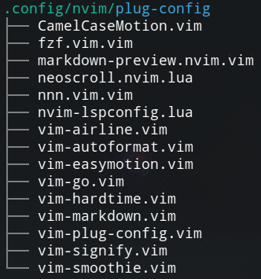

# vim-plug-config

Manage the configs for each vim-plugged plugin in a separate file.



## Requirements

-   [NeoVim](https://github.com/neovim/neovim)
-   [vim-plug](https://github.com/junegunn/vim-plug)

## What it does

-   Automatically load configs for each plugin.
-   Help you manage the config files of the plugins.
-   Supports both Vim Script and Lua config files.

## Installation

```viml
Plug 'ouuan/vim-plug-config'
```

You'd better add this as the first plugin in your plug list to prevent setting configs for other plugins after they are loaded.

Alternatively, you can load the configs on the VimEnter event:

```viml
let g:plug_config_autoload = 0
autocmd VimEnter * PlugConfigLoadAll
```

## Commands

-   `PlugConfigLoad <plug-name>`: Load the config of `<plug-name>`.
-   `PlugConfigLoadAll`: Load the configs of all plugged plugins. By default, it is executed when `vim-plug-config` is loaded.
-   `PlugConfigEdit <plug-name>`: Edit the config of `<plug-name>`. e.g. `:PlugConfigEdit 'vim-plug-config'`
-   `PlugConfigEditUnderCuror`: Edit the plug under the cursor (if there's a `Plug 'owner/repo'` command in the current line). It does nothing if there's no plugged plugin under the cursor.
-   `PlugConfigAll`: Show all plugin configs in a single file. It is useful for looking for a certain setting or restore to a single-file config.
-   `PlugConfigClean`: Delete empty config files and the config files for unplugged plugins.

## Configs

Note: These variables shouldn't be set in the `plug-config` file of `vim-plug-config` itself. i.e. you need to set them in your `init.vim`.

### Keymaps

It's recommended to map a key to `PlugConfigEditUnderCursor` so that you can use it to jump to the config file on the `Plug 'owner/repo'` line.

```viml
nnoremap gp :PlugConfigEditUnderCursor<CR>
```

### `let g:plug_config_autoload`

-   Default: `1`
-   Whether to auto-load all configs at startup.

### `let g:plug_config_vim_dir`

-   Default: `stdpath("config") . "/plug-config"` (e.g. `~/.config/nvim/plug-config`)
-   Where the Vim Script config files are stored.

### `let g:plug_config_lua_dir`

-   Default: `stdpath("config") . "/plug-config"` (e.g. `~/.config/nvim/plug-config`)
-   Where the Lua config files are stored.

### `let g:plug_config_edit_command`

-   Default: `edit`
-   The command used to edit the config file. e.g. `edit`, `split`, `vsplit`.

### `let g:plug_config_default_type`

-   Default: `smart`
-   The language of the config files. There are four possible options:
    1.  `vim`: always use Vim Script.
    2.  `lua`: always use Lua.
    3.  `both`: always use both of Vim Script and Lua.
    4.  `smart`: use Lua if there's a `lua` directory in the plugin, otherwise use Vim Script.

### `let g:plug_config_all_header`

-   Default: `'Configs for plug: {plug}'`
-   The header comment of the config of each plugin shown in `PlugConfigAll`. `{plug}` will be replaced by the name of the plugin.
